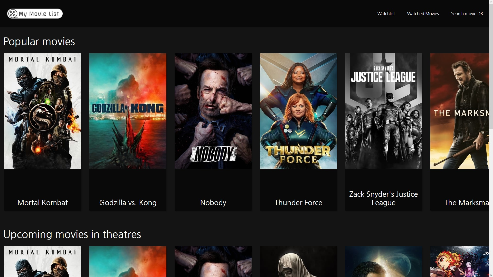
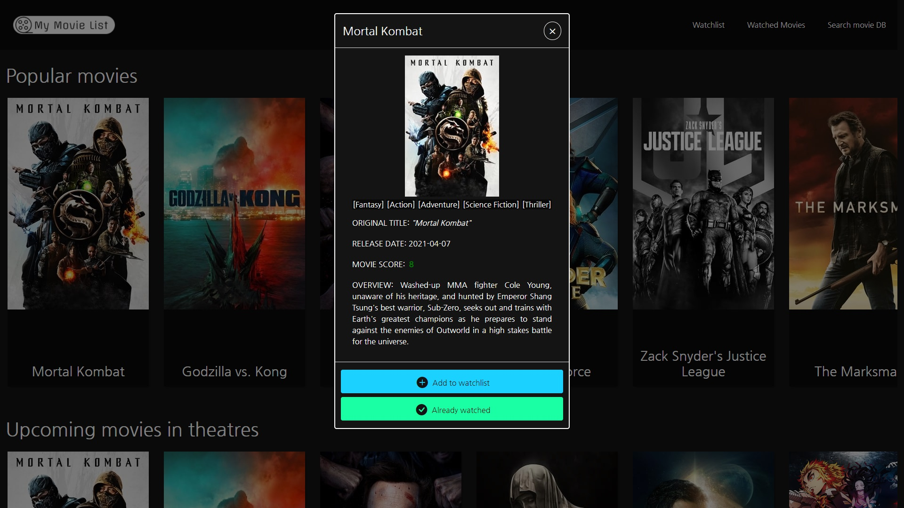
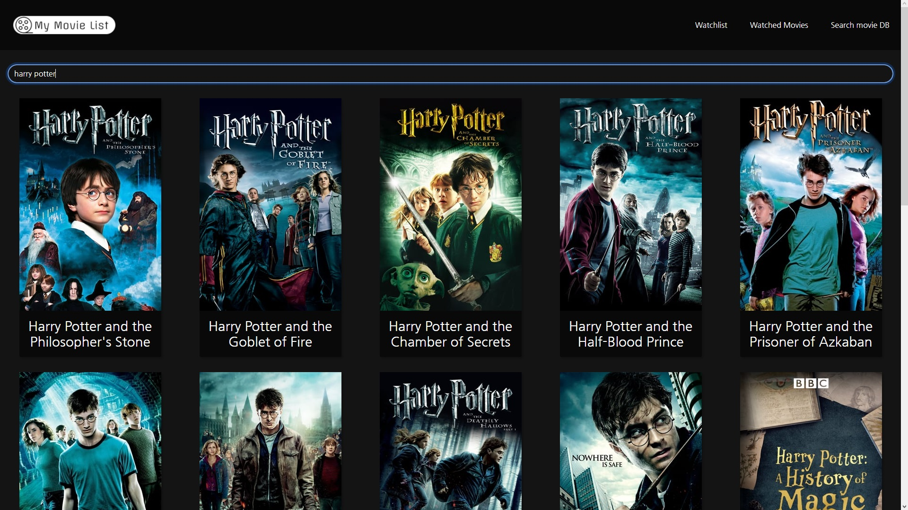

# My-Movie-List
My first bigger project I created for graduation.
Basically project I created back in January 2021 for my graduation.
It's a web app where you can search for movies (using TMDB api https://www.themoviedb.org).
You can create lists of watched movies and movies you want to watch, which are stored in you local storage. So it's all front-end.
I am aware that code isn't that great, but I left it the way it is so I could refer to it and see how much as developer I have grown.

### Main Page

### Selecting Movie

### Searching for Movies

